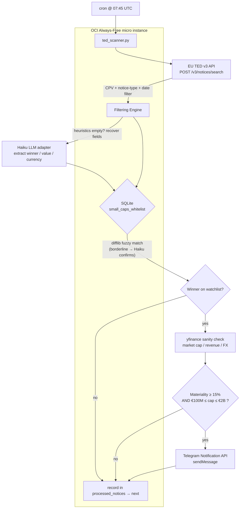

# ted_bot 🛰️

Daily automated scanner for **EU TED (Tenders Electronic Daily)** Contract Award
Notices. It detects major public-procurement awards won by publicly-traded
European small-caps, computes the **financial materiality** of each award, and
fires an instant **Telegram** push when an award is large relative to the
winner's revenue.

Designed for a zero-cost **OCI Always-Free `VM.Standard.E2.1.Micro`** running
**Oracle Linux 9**, an embedded **SQLite** database, and outbound-only network
access (no inbound service, no framework, one cron line).

---

## 1. Architecture Overview

A single Python process runs once a day from cron. It streams the previous day's
Contract Award Notices from the TED v3 API, filters by high-alpha CPV divisions,
fuzzy-matches winner names against a local watchlist, sanity-checks financials
via `yfinance`, and alerts only when both the materiality and market-cap gates
pass. Every examined notice is written to `processed_notices`, so re-runs are
idempotent and never double-alert.



**Decision rule (both must hold):**

| Gate | Condition |
|------|-----------|
| Materiality | `contract_value_EUR / annual_revenue_EUR ≥ 15%` |
| Size band | `€100M ≤ market_cap ≤ €2B` |

**CPV divisions watched:** Tech/Software `72000000`, Defense/Security
`35000000`, Biotech/Medical `33000000`, Green Energy/Infra `09330000`.

> ℹ️ **API calibration.** TED's eForms field names change between API revisions.
> `ted_scanner.py` requests a best-effort field set and, on a `4xx`, retries
> without it and extracts winner/value/currency by a resilient key-name search.
> Run `python3 ted_scanner.py --dump 3 | less` to inspect the live JSON shape and
> tune `REQUEST_FIELDS` / `NOTICE_TYPES` at the top of the script if needed.

> 🧠 **Adapt-in-the-loop (optional).** Set `ANTHROPIC_API_KEY` to enable a small
> LLM (`claude-haiku-4-5`) that makes the pipeline self-healing on two fronts:
> when the key-name heuristics can't read a notice (schema drift), Haiku extracts
> `winner` / `value` / `currency` straight from the raw JSON; and when a fuzzy
> match lands in the grey zone (difflib ratio `0.70–0.87`), Haiku decides whether
> the TED winner and the watchlist company are the same entity — catching
> translations, abbreviations, and holding-company names difflib misses. **No key
> set → the LLM calls return `None` and the scanner runs pure-heuristic, at zero
> cost.** Override the model with `TED_LLM_MODEL`.

---

## 2. Quick Start & Installation (Oracle Linux 9)

```bash
# 1. System packages
sudo dnf install -y python3 python3-pip git sqlite

# 2. Clone
git clone https://github.com/cluster2600/ted_bot.git
cd ted_bot

# 3. Isolated environment + dependencies
python3 -m venv .venv
source .venv/bin/activate
pip install --upgrade pip
pip install -r requirements.txt

# 4. Create the SQLite schema
python3 ted_scanner.py --init-db

# 5. Telegram credentials (create a bot via @BotFather, get your chat id)
export TELEGRAM_BOT_TOKEN="123456:ABC-your-token"
export TELEGRAM_CHAT_ID="987654321"
export ANTHROPIC_API_KEY="sk-ant-..."   # optional — enables the Haiku adapter

# 6. Verify offline logic, then a live no-send dry run
python3 ted_scanner.py --selftest
python3 ted_scanner.py --dry-run -v
```

> Persist the Telegram variables for cron by adding the two `export` lines to
> `~/.bashrc`, or better, to an EnvironmentFile referenced by the cron entry
> (see §4).

---

## 3. Populating the Small-Cap Whitelist

The watchlist lives in `small_caps_whitelist`. The matcher compares the TED
winner text against **`company_name_cleaned`**, which must be the normalised
legal name: lower-case, no punctuation, no legal suffix (`SA`, `GmbH`, `SpA`…).
The script normalises TED text the same way, so keep entries in that form.

| Column | Meaning | Example |
|--------|---------|---------|
| `company_name_cleaned` | normalised name for matching (required) | `exail technologies` |
| `ticker` | yfinance symbol (enables auto-refresh & FX) | `EXA.PA` |
| `isin` | optional exact key | `FR0012160365` |
| `exchange` | informational | `Euronext Paris` |
| `annual_revenue_eur` | materiality denominator | `184000000` |
| `market_cap` | EUR; the €100M–€2B gate | `520000000` |

Insert targets with plain SQL:

```bash
sqlite3 ted.db <<'SQL'
INSERT INTO small_caps_whitelist
  (company_name_cleaned, ticker, isin, exchange, annual_revenue_eur, market_cap)
VALUES
  ('exail technologies', 'EXA.PA', 'FR0012160365', 'Euronext Paris', 184000000, 520000000),
  ('theon international', 'THEON.AS', 'GRW000000009', 'Euronext Amsterdam', 271000000, 1600000000);
SQL
```

Leave `annual_revenue_eur` or `market_cap` **NULL** to have the scanner fetch and
persist them from `yfinance` on the next matching run (a `ticker` is required for
that). Populated rows are reused as-is, so you control accuracy.

> **Materiality math is only as good as `annual_revenue_eur`.** For non-EUR
> reporters, store revenue already converted to EUR.

---

## 4. Deployment — daily cron at 07:45 UTC

Register the scanner to run every morning at **07:45 UTC**, logging (stdout +
stderr) to `~/ted_scanner.log`. Add this with `crontab -e` (edit the path/user to
match your clone; `opc` is the default OCI user):

```cron
CRON_TZ=UTC
45 7 * * * cd /home/opc/ted_bot && /home/opc/ted_bot/.venv/bin/python3 ted_scanner.py >> /home/opc/ted_scanner.log 2>&1
```

`CRON_TZ=UTC` pins the schedule to UTC regardless of the instance timezone. If
your `cron` build ignores `CRON_TZ`, set the host clock with
`sudo timedatectl set-timezone UTC` and use a plain `45 7 * * *` line.

For Telegram credentials in cron without hard-coding them in the crontab, source
an env file at the start of the command:

```cron
45 7 * * * cd /home/opc/ted_bot && set -a && . /home/opc/ted_bot/.env && set +a && .venv/bin/python3 ted_scanner.py >> /home/opc/ted_scanner.log 2>&1
```

`.env`:

```dotenv
TELEGRAM_BOT_TOKEN=123456:ABC-your-token
TELEGRAM_CHAT_ID=987654321
ANTHROPIC_API_KEY=sk-ant-...
```

> `chmod 600 .env` and keep it out of git (add it to `.gitignore`).

---

## Command reference

| Command | Purpose |
|---------|---------|
| `python3 ted_scanner.py --init-db` | create the SQLite schema |
| `python3 ted_scanner.py` | daily scan (cron target) |
| `python3 ted_scanner.py --dry-run -v` | scan and log decisions; send nothing, record nothing |
| `python3 ted_scanner.py --dump 3` | print raw JSON of 3 notices (field discovery) |
| `python3 ted_scanner.py --selftest` | offline logic self-check |

## License

MIT.
