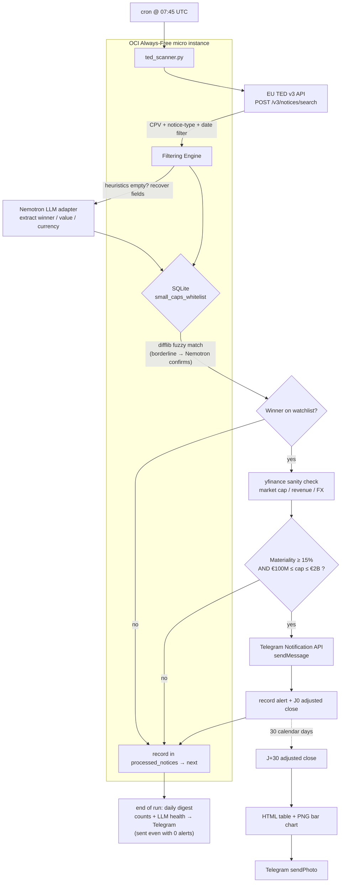

# ted_bot 🛰️

Daily automated scanner for **EU TED (Tenders Electronic Daily)** Contract Award
Notices. It detects major public-procurement awards won by publicly-traded
European small-caps, computes the **financial materiality** of each award, and
fires an instant **Telegram** push when an award is large relative to the
winner's revenue.

Designed for a zero-cost **OCI Always-Free `VM.Standard.E2.1.Micro`** running
**Oracle Linux 9**, an embedded **SQLite** database, and outbound-only network
access (no inbound service, no framework, one cron line).

---

## 1. Architecture Overview

A single Python process runs once a day from cron. It streams the previous day's
Contract Award Notices from the TED v3 API, filters by high-alpha CPV divisions,
fuzzy-matches winner names against a local watchlist, sanity-checks financials
via `yfinance`, and alerts only when both the materiality and market-cap gates
pass. Every examined notice is written to `processed_notices`, so re-runs are
idempotent and never double-alert. A successfully delivered alert is also
written to `alerts`; 30 calendar days later the bot measures the adjusted share
price return, regenerates an HTML table plus PNG chart, and sends the graph to
Telegram.



**Decision rule (both must hold):**

| Gate | Condition |
|------|-----------|
| Materiality | `contract_value_EUR / annual_revenue_EUR ≥ 15%` |
| Size band | `€100M ≤ market_cap ≤ €2B` |

**CPV divisions watched:** Tech/Software `72000000`, Defense/Security
`35000000`, Biotech/Medical `33000000`, Green Energy/Infra `09330000`.

> ℹ️ **API calibration.** The query grammar, the `fields` vocabulary, and the
> winner/value/currency extraction are validated against the live TED v3 API — a
> notice's `winner-name` and `notice-title` are language-keyed dicts, values are
> string-numbers, and `fields` is required from a 1830-term eForms vocabulary. If
> TED renames a term later, the scanner retries with a minimal field set and falls
> back to key-name search (and the LLM); re-inspect with
> `python3 ted_scanner.py --dump 3 | less` and adjust `REQUEST_FIELDS` if needed.

> 🧠 **Adapt-in-the-loop (optional).** Set `NVIDIA_API_KEY` to enable a small
> LLM (`nvidia/nemotron-3-ultra-550b-a55b`, served by
> `integrate.api.nvidia.com`) that makes the pipeline self-healing on two fronts:
> when the key-name heuristics can't read a notice (schema drift), the model extracts
> `winner` / `value` / `currency` straight from the raw JSON; and when a fuzzy
> match lands in the grey zone (difflib ratio `0.70–0.87`), the model decides whether
> the TED winner and the watchlist company are the same entity — catching
> translations, abbreviations, and holding-company names difflib misses. **No key
> set → the LLM calls return `None` and the scanner runs pure-heuristic, at zero
> cost.** Override the model with `TED_LLM_MODEL` — it must be an NVIDIA id of the
> form `vendor/model`; a bare name is rejected by the endpoint, and the scanner now
> exits non-zero (and withholds the heartbeat) rather than reporting a green,
> alert-less run.

---

## 2. Quick Start & Installation (Oracle Linux 9)

```bash
# 1. System packages
sudo dnf install -y python3 python3-pip git sqlite

# 2. Clone
git clone https://github.com/cluster2600/ted_bot.git
cd ted_bot

# 3. Isolated environment + dependencies
python3 -m venv .venv
source .venv/bin/activate
pip install --upgrade pip
pip install -r requirements.txt

# 4. Create the SQLite schema
python3 ted_scanner.py --init-db

# 5. Telegram credentials (create a bot via @BotFather, get your chat id)
export TELEGRAM_BOT_TOKEN="123456:ABC-your-token"
export TELEGRAM_CHAT_ID="987654321"
export NVIDIA_API_KEY="nvapi-..."       # optional — enables the Nemotron adapter
export CLOUDFLARE_ACCOUNT_ID="32-hex-character-account-id"  # optional report
export CLOUDFLARE_API_TOKEN="pages-edit-token"               # optional report

# 6. Verify offline logic, then a live no-send dry run
python3 ted_scanner.py --selftest
python3 ted_scanner.py --dry-run -v
```

> Persist the Telegram variables for cron by adding the two `export` lines to
> `~/.bashrc`, or better, to an EnvironmentFile referenced by the cron entry
> (see §4).

---

## 3. Populating the Small-Cap Whitelist

The watchlist lives in `small_caps_whitelist`. The matcher compares the TED
winner text against **`company_name_cleaned`**, which must be the normalised
legal name: lower-case, no punctuation, no legal suffix (`SA`, `GmbH`, `SpA`…).
The script normalises TED text the same way, so keep entries in that form.

| Column | Meaning | Example |
|--------|---------|---------|
| `company_name_cleaned` | normalised name for matching (required) | `exail technologies` |
| `ticker` | yfinance symbol (enables auto-refresh & FX) | `EXA.PA` |
| `isin` | optional exact key | `FR0012160365` |
| `exchange` | informational | `Euronext Paris` |
| `annual_revenue_eur` | materiality denominator | `184000000` |
| `market_cap` | EUR; the €100M–€2B gate | `520000000` |

Insert targets with plain SQL:

```bash
sqlite3 ted.db <<'SQL'
INSERT INTO small_caps_whitelist
  (company_name_cleaned, ticker, isin, exchange, annual_revenue_eur, market_cap)
VALUES
  ('exail technologies', 'EXA.PA', 'FR0012160365', 'Euronext Paris', 184000000, 520000000),
  ('theon international', 'THEON.AS', 'GRW000000009', 'Euronext Amsterdam', 271000000, 1600000000);
SQL
```

Leave `annual_revenue_eur` or `market_cap` **NULL** to have the scanner fetch and
persist them from `yfinance` on the next matching run (a `ticker` is required for
that). Populated rows are reused as-is, so you control accuracy.

> **Materiality math is only as good as `annual_revenue_eur`.** Rows the scanner
> fills from `yfinance` are converted to EUR automatically — market cap from the
> quote currency, revenue from the *reporting* currency (they differ: `AVON.L`
> quotes in GBp but reports in USD). Rows **you** insert by hand are taken at face
> value, so store those already converted to EUR.

> ⚠️ **Upgrading from a build before the FX fix?** Cached rows hold raw
> yfinance figures in the stock's own currency, and a row with both fields set is
> never refetched — so run `python3 ted_scanner.py --reset-financials` once. Until
> you do, every non-EUR company keeps failing the €100M–€2B band by roughly its FX
> rate (a DKK cap reads ~7.5x too large and is silently rejected as "too big").

---

## 4. Deployment — daily cron at 07:45 UTC

Register the scanner to run every morning at **07:45 UTC**, logging (stdout +
stderr) to `~/ted_scanner.log`. Add this with `crontab -e` (edit the path/user to
match your clone; `opc` is the default OCI user):

```cron
CRON_TZ=UTC
45 7 * * * cd /home/opc/ted_bot && /home/opc/ted_bot/.venv/bin/python3 ted_scanner.py >> /home/opc/ted_scanner.log 2>&1
```

`CRON_TZ=UTC` pins the schedule to UTC regardless of the instance timezone. If
your `cron` build ignores `CRON_TZ`, set the host clock with
`sudo timedatectl set-timezone UTC` and use a plain `45 7 * * *` line.

For Telegram credentials in cron without hard-coding them in the crontab, source
an env file at the start of the command:

```cron
45 7 * * * cd /home/opc/ted_bot && set -a && . /home/opc/ted_bot/.env && set +a && .venv/bin/python3 ted_scanner.py >> /home/opc/ted_scanner.log 2>&1
```

`.env`:

```dotenv
TELEGRAM_BOT_TOKEN=123456:ABC-your-token
TELEGRAM_CHAT_ID=987654321
NVIDIA_API_KEY=nvapi-...
```

> `chmod 600 .env` and keep it out of git (add it to `.gitignore`).

### J+30 alert evaluation

The normal daily command runs the TED scan first, then evaluates due alerts and
publishes the dashboard so alerts delivered during that run appear immediately.
For each Telegram alert, the bot stores the ticker, contract value, alert time
and latest adjusted close. At J+30 it uses the first available market close on
or after the due date; weekends and exchange holidays therefore remain pending
until a real close exists.

Outputs are written below `reports/` (gitignored):

- `ted-alertes-j30.html` — dashboard with signal count, cumulative contract
  value, contract-to-market-cap intensity, J+30 progress and the full alert
  pipeline;
- `ted-alertes-j30.png` — horizontal comparison of published contract values
  while all alerts are pending, then a colorblind-friendly J+30 return chart
  once evaluations are available.

When one or more evaluations become complete, the PNG and a compact table are
sent to Telegram once. These returns are observations, not proof that the TED
award caused the share-price move. Alerts emitted before this schema existed
cannot be backfilled reliably because the previous scanner stored only the
processed notice identifier.

When `CLOUDFLARE_API_TOKEN` and `CLOUDFLARE_ACCOUNT_ID` are configured, the
same daily job also publishes the latest HTML and PNG to the Direct Upload
Pages project selected by `TED_REPORT_PROJECT` (default:
`ted-bot-j30-report`). Cloudflare serves it over HTTPS at the project's stable
`*.pages.dev` FQDN. The static site uses `noindex`, a deny-all `robots.txt`, a
restrictive Content Security Policy and no client-side script; OCI keeps its
outbound-only network posture.

Operational commands:

```bash
# Evaluate due alerts, refresh both files, and send new results to Telegram
python3 ted_scanner.py --evaluate-alerts

# Rebuild the table and chart from SQLite without market or Telegram calls
python3 ted_scanner.py --evaluation-report

# Rebuild and immediately publish the current report to Cloudflare Pages
python3 ted_scanner.py --publish-report
```

### Daily digest — proof the bot worked

Alerts are rare by design, so an alert-less morning used to look exactly like a
dead cron: nothing arrives either way. Every real run therefore closes with one
short Telegram summary, **whether or not anything fired**:

```
✅ ted_bot — scan OK
2026-08-27 07:45 UTC · 51s

Notices TED récupérées: 312
Nouvelles examinées: 118 (déjà vues: 194)
Gagnants cotés identifiés: 3
Alertes envoyées: 0
Appels LLM: 14 (0 échec(s))

Rien de matériel aujourd'hui. Le bot a bien tourné.
```

The counts are what separate "quiet day" from "broken day": `0` fetched means
the TED query returned nothing, `0` examined with a high skip count means the
lookback window held no new notices, and a red header means the LLM adapter
failed on every call (winner recovery and fuzzy-match confirmation were skipped,
so alerts may be missing). If the scan crashes before it can count anything —
TED API down, DB locked — a red crash digest carrying the exception is sent
instead. Set `TED_DAILY_DIGEST=0` to silence it and keep alert-only behaviour.

A candidate whose ticker returns no market cap is dropped by the €100M–€2B gate
without ever being judged on merit, so the digest calls that out separately
(`⚠️ Écartés faute de données marché`) instead of reporting an all-clear. When
the winner came from LLM resolution, its cache entry is also **forgotten**, so a
later run resolves it again rather than re-using a symbol that yields nothing —
see § *Winner resolution cache* below.

> The digest cannot report a run that never started. Pair it with
> `TED_HEARTBEAT_URL` (§ *What only you can do*, item 5): the digest proves the
> bot worked, healthchecks.io catches the morning it doesn't boot at all.

---

## What only you can do (accounts & secrets)

The code and infra are ready; these need your accounts:

1. **Telegram bot** — create one with [@BotFather](https://t.me/BotFather), copy the
   token, send your bot a message, then find your chat id, and verify delivery:
   ```bash
   TELEGRAM_BOT_TOKEN=123:ABC ./deploy/get_chat_id.sh
   TELEGRAM_BOT_TOKEN=123:ABC TELEGRAM_CHAT_ID=987 python3 ted_scanner.py --test-telegram
   ```
2. **Whitelist** — the fast path is to seed from tickers (pulls name/ISIN/revenue/
   market-cap via yfinance, normalising names to match TED text):
   ```bash
   python3 deploy/seed_from_tickers.py EXA.PA THEON.AS SWP.PA > deploy/whitelist.sql
   ```
   Review it (yfinance figures are in the stock's reporting currency; materiality
   assumes EUR), then commit `deploy/whitelist.sql` — cloud-init auto-seeds it.
   `annual_revenue_eur` accuracy drives materiality.
3. **OCI API key** — use a dedicated, least-privilege OCI deployment identity;
   feed its values into `terraform/terraform.tfvars` (see `terraform/README.md`).
4. **`NVIDIA_API_KEY`** *(optional)* — for the Nemotron adapter; get one at
   [build.nvidia.com](https://build.nvidia.com).
5. **Heartbeat** *(optional but recommended)* — create a check at
   [healthchecks.io](https://healthchecks.io), put its ping URL in `TED_HEARTBEAT_URL`
   so a silently-failed cron pages you.
6. **Remote J+30 report** — use a dedicated API token limited to Cloudflare
   Pages edits on the selected account. Store `CLOUDFLARE_API_TOKEN`,
   `CLOUDFLARE_ACCOUNT_ID` and optionally `TED_REPORT_PROJECT` in the approved
   TED Bot OpenBao application path; never commit them or put them in Terraform.

Application secrets are streamed to `deploy/install-secrets.sh` only after the
VM is provisioned. They are not accepted as Terraform variables and therefore
do not enter Terraform state, cloud-init user data, or OCI instance metadata.

## Winner resolution cache

Off-whitelist winners are consolidated to their listed parent by the LLM and
cached in `resolved_entities`, hit **and** miss, so any given winner costs at
most one LLM call ever. That permanence is the point — and it was also the trap:
the model answered `SYN.WA` for Synektik (the real symbol is `SNT.WA`), the row
was cached, and from then on every Synektik award priced at `cap=None` and was
held in silence. No retry was ever possible.

A cached resolution whose ticker yields no market data is now **forgotten** at
the end of that candidate's evaluation, so the next run resolves it afresh. To
audit or purge the cache by hand:

```bash
sqlite3 ted.db "SELECT winner_clean, parent_name, ticker FROM resolved_entities WHERE listed=1;"
sqlite3 ted.db "DELETE FROM resolved_entities WHERE ticker IN ('SYN.WA','SNY.PA','ACE.WA');"
```

Ticker symbols are worth auditing periodically for a second reason: European
small-caps get taken private, and a delisted name simply stops returning data.
As of 2026-08-27, Biotage, Esker, SII, Formpipe and Innofactor had gone dark on
Yahoo and were commented out of `deploy/whitelist.sql`; SMA Solar moved from
`S92.DE` (name resolves, no `marketCap`) to `S92.F`, which carries the figure.

## Operations extras

- **Log rotation** — `deploy/ted_bot.logrotate` (installed to `/etc/logrotate.d/`).
- **DB backup** — `deploy/backup.sh` runs weekly (Sun 03:15 UTC), keeps 4 local
  snapshots (including alert evaluations), and uploads one to
  `OCI_BACKUP_BUCKET` if set.
- **Heartbeat** — `TED_HEARTBEAT_URL` is pinged with `?notices=&alerts=` after each run.
- **Daily digest** — one Telegram summary per run, alerts or not; `TED_DAILY_DIGEST=0` disables it.
- **FQDN + TLS** *(only if you expose a service)* — [`docs/dns-tls.md`](docs/dns-tls.md):
  free DuckDNS hostname + Let's Encrypt cert via DNS-01 (no inbound ports).

## Command reference

| Command | Purpose |
|---------|---------|
| `python3 ted_scanner.py --init-db` | create the SQLite schema |
| `python3 ted_scanner.py` | daily scan (cron target) |
| `python3 ted_scanner.py --dry-run -v` | scan and log decisions; send nothing, record nothing |
| `python3 ted_scanner.py --dump 3` | print raw JSON of 3 notices (field discovery) |
| `python3 ted_scanner.py --evaluate-alerts` | evaluate due J+30 alerts, rebuild and send the graph |
| `python3 ted_scanner.py --evaluation-report` | rebuild the local HTML table and PNG without network calls |
| `python3 ted_scanner.py --publish-report` | rebuild and publish the report to its Cloudflare Pages FQDN |
| `python3 ted_scanner.py --reset-financials` | clear cached cap/revenue so they refetch in EUR |
| `python3 ted_scanner.py --selftest` | offline logic self-check |

## License

MIT.
