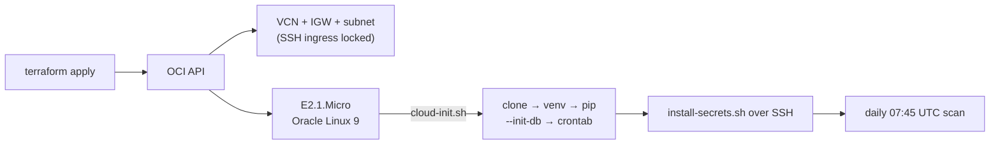

# ted_bot — OCI Terraform

One `terraform apply` provisions the Always-Free AMD micro instance and boots a
scanner host: VCN + internet gateway + SSH-restricted subnet, an
`VM.Standard.E2.1.Micro` running Oracle Linux 9, and a cloud-init that clones the
public repository, installs dependencies, initialises SQLite and registers the
07:45 UTC cron. Application secrets are installed afterwards over SSH so they do
not enter Terraform state or OCI instance metadata.



## Prerequisites

1. **Terraform** ≥ 1.3 and an OCI tenancy (the Always-Free tier is enough).
2. **An OCI API signing key.** In the Console: *Profile → My profile → API keys →
   Add API key*, download the private key, and copy the shown config values
   (`tenancy_ocid`, `user_ocid`, `fingerprint`, `region`).
3. **An SSH keypair** — the public key goes on the box.
4. The public `cluster2600/ted_bot` repository must remain reachable from the
   instance during first boot.

## Apply

```bash
cd terraform
cp terraform.tfvars.example terraform.tfvars   # then edit
terraform init
terraform plan
terraform apply
```

Outputs the public IP and SSH command. First boot runs cloud-init; watch it with:

```bash
ssh opc@<public_ip> 'tail -f /var/log/ted_bot_bootstrap.log'
```

After cloud-init finishes, stream a JSON object from the approved secret manager
directly to the installer. Do not save this payload to a local file:

```bash
secret-manager-read-ted-bot | \
  ssh opc@<public_ip> 'sudo bash /home/opc/ted_bot/deploy/install-secrets.sh'
```

The payload requires `TELEGRAM_BOT_TOKEN` and `TELEGRAM_CHAT_ID`. It may also
contain `NVIDIA_API_KEY`, `TED_LLM_MODEL`, `TED_LOOKBACK_DAYS`,
`TED_HEARTBEAT_URL`, and `OCI_BACKUP_BUCKET`. The installer rejects unknown
keys, writes `/home/opc/ted_bot/.env` as mode `0600`, runs a dry scan and sends a
Telegram test message before reporting success.

The same stream can be checked without installing it by passing
`--validate-only`; validation reports only success or missing/unknown key names,
never values.

## Seeding the whitelist

`cloud-init.sh` loads `deploy/whitelist.sql` **if it exists in the repo**. Copy the
example, edit your targets, commit, then apply (or re-run the seed on the box):

```bash
cp deploy/whitelist.example.sql deploy/whitelist.sql   # edit, then commit
```

Without it the box starts with an empty whitelist (scanner runs, alerts on nothing)
until you populate `small_caps_whitelist` — see the root README §3.

## Notes

- **State is local** (`terraform.tfstate`) and contains infrastructure metadata —
  it is gitignored. Application secrets never enter the state. Move to an
  encrypted remote backend (OCI Object Storage) for team use.
- **E2.1.Micro capacity** on Always-Free can be tight in busy regions; if `apply`
  returns an out-of-host-capacity error, retry or pick another availability domain.
- **Rotating secrets:** stream the new JSON payload through
  `deploy/install-secrets.sh`; Terraform is not involved.
- **Updating code:** SSH in and `git pull`; changing `user_data` forces instance
  replacement.
- **`terraform destroy`** tears the whole stack down.
