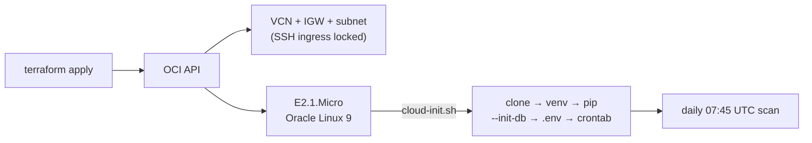

# ted_bot — OCI Terraform

One `terraform apply` provisions the Always-Free AMD micro instance and boots a
fully wired scanner: VCN + internet gateway + SSH-restricted subnet, an
`VM.Standard.E2.1.Micro` running Oracle Linux 9, and a cloud-init that clones the
repo, installs deps, initialises SQLite, writes `.env`, and registers the 07:45 UTC
cron — no manual SSH step required.



## Prerequisites

1. **Terraform** ≥ 1.3 and an OCI tenancy (the Always-Free tier is enough).
2. **An OCI API signing key.** In the Console: *Profile → My profile → API keys →
   Add API key*, download the private key, and copy the shown config values
   (`tenancy_ocid`, `user_ocid`, `fingerprint`, `region`).
3. **An SSH keypair** — the public key goes on the box.
4. If the GitHub repo is **private**, a fine-grained PAT with `contents:read`
   (`github_token`). If you make the repo public, leave it empty.

## Apply

```bash
cd terraform
cp terraform.tfvars.example terraform.tfvars   # then edit
terraform init
terraform plan
terraform apply
```

Outputs the public IP and SSH command. First boot runs cloud-init; watch it with:

```bash
ssh opc@<public_ip> 'tail -f /var/log/ted_bot_bootstrap.log'
```

## Seeding the whitelist

`cloud-init.sh` loads `deploy/whitelist.sql` **if it exists in the repo**. Copy the
example, edit your targets, commit, then apply (or re-run the seed on the box):

```bash
cp deploy/whitelist.example.sql deploy/whitelist.sql   # edit, then commit
```

Without it the box starts with an empty whitelist (scanner runs, alerts on nothing)
until you populate `small_caps_whitelist` — see the root README §3.

## Notes

- **State is local** (`terraform.tfstate`) and holds secrets — it's gitignored.
  Move to an encrypted remote backend (OCI Object Storage) for team use.
- **E2.1.Micro capacity** on Always-Free can be tight in busy regions; if `apply`
  returns an out-of-host-capacity error, retry or pick another availability domain.
- **Rotating secrets / code:** edit `terraform.tfvars` and `apply` rebuilds only what
  changed. Changing `user_data` forces instance replacement — for a code-only update,
  SSH in and `git pull` instead.
- **`terraform destroy`** tears the whole stack down.
